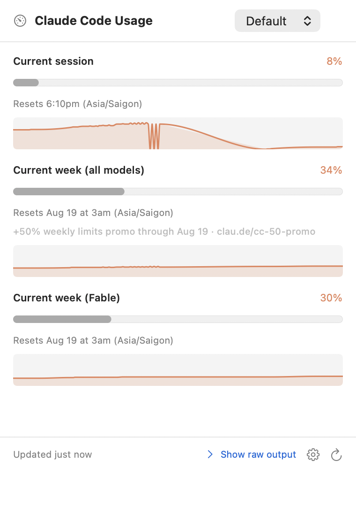

# CC Usage Bar

A macOS menu-bar app that shows your Claude Code usage at a glance.


```
 ◔ 62% · 28%      ← current session · current week (all models)
```




Click it for a native popover with a real progress bar per section, the reset time, and a
24-hour sparkline. Right-click for refresh, profile switching, settings and quit.

## Why it exists

Claude Code already knows your usage — `/usage` prints it. But `/usage` only exists inside
an interactive session, and the numbers matter most when you are *not* looking at a
terminal. This app runs that command for you and puts the answer in the menu bar.

## How it works

There is exactly one moving part:

```
/bin/zsh -l -c claude        ← inside a PTY, cwd = a fresh empty temp directory
        ↓ raw bytes
UTF8StreamDecoder            ← incremental; a multi-byte glyph split across reads survives
        ↓ text
ANSIInterpreter → ANSIScreen ← a virtual terminal; Ink repaints differentially, so the
        ↓ plain text           screen must be replayed, not regex-stripped
UsageParser                  ← anchored on the "NN% used" line, not on known section names
        ↓ UsageSnapshot
menu bar · popover · history · notifications
```

The login shell is used so that `claude` is found on your normal `PATH`. The working
directory is a fresh empty temporary directory, so Claude Code never sees one of your
projects. The only bytes ever written to the terminal are `/usage`, Return, and Escape.

## Safety model

This app is designed so that it *cannot* leak your Claude credentials, and so that the
claim is cheap to re-verify. These invariants are enforced by review and by
`grep`-able absence:

| # | Invariant |
|---|-----------|
| S1 | **No network.** No `URLSession`, `URLRequest`, `NWConnection`, or sockets anywhere in the app target. |
| S2 | **No Keychain.** No `SecItem*` or `kSec*` API. |
| S3 | **No credential access.** Never reads `~/.claude`, `.credentials.json`, or anything containing `sk-ant`. The only writes are the app's own Application Support directory and a per-session temporary directory. |
| S4 | **One subprocess shape.** `/bin/zsh -l -c claude` in a PTY. There is a single `execve` call site, in `PTYProcess.launch`. |
| S5 | **No third-party dependencies.** Apple frameworks only. |
| S6 | **No build scripts.** App sandbox off (required for `fork`/`exec`), hardened runtime on. |

Verify them yourself:

```sh
grep -rnE 'URLSession|URLRequest|NWConnection|socket\(|SecItem|kSecClass|\.claude/|credentials|sk-ant' CCUsageBar/
grep -rn 'execv' CCUsageBar/
otool -L "$(xcodebuild -scheme CCUsageBar -configuration Release -showBuildSettings \
  | awk '/BUILT_PRODUCTS_DIR/{d=$3} /FULL_PRODUCT_NAME/{n=$3} END{print d"/"n}')/Contents/MacOS/CCUsageBar"
```

Profiles set `CLAUDE_CONFIG_DIR` to a directory **you** pick with an open panel. The app
never reads that directory itself; it only hands the path to Claude Code.

## Features

- **Menu bar** — `47% · 25%`, default colour up to 69%, orange 70–89%, red from 90%. Icon-only mode available. Dimmed `—` when the state is unknown.
- **Popover** — one row per section reported by `/usage`, in the order Claude Code prints them, with a progress bar, reset time, and a 24h sparkline. A "Show raw output" disclosure renders the terminal screen with its ANSI colours as a fallback.
- **Auto-refresh** — off / 1 / 5 / 15 / 30 / 60 minutes, plus a refresh on wake from sleep. Two fetches for the same profile never overlap.
- **Notifications** — configurable thresholds (default 80% and 95%), fired once per section, per profile, per reset window. Permission is requested lazily, on first enable.
- **History** — every successful fetch is appended to `~/Library/Application Support/CCUsageBar/history.jsonl`, kept for 30 days, and charted over 24h / 7d / 30d.
- **Profiles** — several Claude Code configurations, each with its own session.
- **Launch at login** — via `SMAppService`.

## Requirements

- macOS 15 (Sequoia) or later
- Claude Code installed and already logged in — run `claude` in Terminal once first

## Build

```sh
xcodebuild -scheme CCUsageBar -configuration Release build
xcodebuild test -scheme CCUsageBar
```

No package manager, no code generation, no bootstrap step.

## Screenshots

`docs/screenshots/` holds renders of the shipping views, taken from a live run against
this machine's real Claude Code session: the menu bar item, the popover, the ANSI raw
output fallback, and every Settings tab.

## Credits

Inspired by [cc-usage-bar](https://github.com/lionhylra/cc-usage-bar) by Yilei He (MIT).
This is an independent rewrite; no source was copied. MIT licensed — see `LICENSE`.
